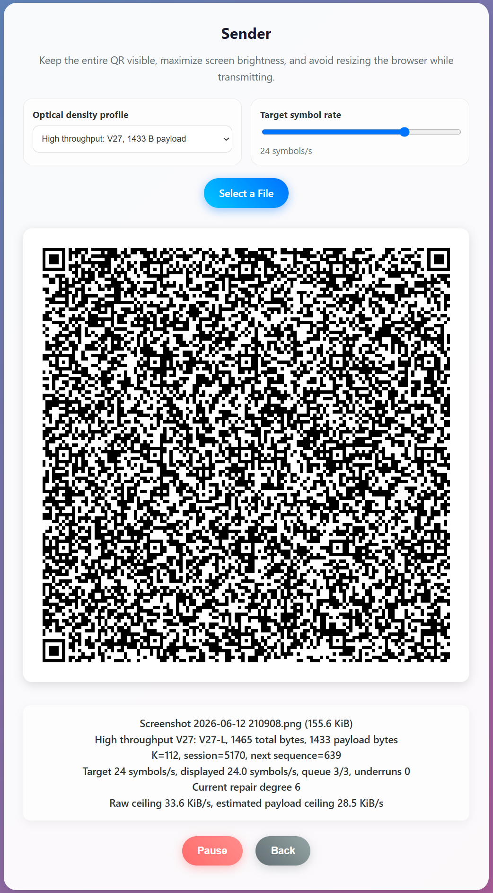

<div align="center">

# AirQR — Airgapped File Transfer

[](https://github.com/victoralv/airqr/releases)
[](#)
[](LICENSE)
[](#)

**Airgapped file transfer using animated QR codes.**  
Transfer files directly from one screen to another camera. Powered by **Fountain Codes** running locally on your device, ensuring complete data privacy with zero network connectivity required.

*Based on [Decimen Optical Transfer](https://github.com/bashalarmistalt/decimen-optical-transfer/).*

[Report an Issue](https://github.com/victoralv/airqr/issues)




[Test it live](https://victoralv.github.io/AirQR/)
</div>


---

## Why AirQR?

| Feature | Cloud Storage | Bluetooth / AirDrop | **AirQR** |
|---|:---:|:---:|:---:|
| 100% Offline (No Internet) | ❌ | ✅ | ✅ |
| No Device Pairing/Handshake | ✅ | ❌ | ✅ |
| Cross-Platform (iOS/Android/PC) | ✅ | ❌ | ✅ |
| True Airgapped Security | ❌ | ❌ | ✅ |
| No Servers / No Tracking | ❌ | ✅ | ✅ |
| Immune to network interception | ❌ | ❌ | ✅ |

---

## Key Features

- **Optical Data Transfer** — Files are encoded into a continuous stream of animated QR codes. The receiving device's camera captures these frames to mathematically reconstruct the file.
- **Systematic Fountain Codes (Hybrid LT)** — The first K symbols transmitted are uncoded source blocks. Every subsequent symbol generated is a deterministic Luby Transform (LT) repair equation. This guarantees rapid assembly if no frames are dropped, while retaining mathematically infinite recovery capabilities.
- **Multi-threaded WebAssembly Decoding** — The receiver captures camera frames independently of decoding and distributes them across several WebAssembly workers. It relies on ZXing-WASM 3.1.2, with each worker instantiating its own decoder. If WASM cannot initialize, it falls back to a slower embedded jsQR decoder.
- **Optical Density Profiles** — Senders can choose between three transfer profiles based on display and camera quality:
  - *Compatibility:* QR Version 19, 700 bytes payload per block.
  - *High Throughput (Default):* QR Version 27, 1433 bytes payload per block.
  - *Maximum Density:* QR Version 40, 2921 bytes payload per block.
- **Advanced Hardware Control** — Utilizes the Screen Wake Lock API to prevent devices from sleeping during transfers. The camera also applies advanced constraints to enable continuous focus, exposure, and white balance modes.
- **Zero Network Required** — The transfer is exclusively optical. Zero data is transmitted over the internet or stored on any server. 

---

## How It Works

AirQR uses a sender-receiver architecture without traditional network protocols. It bridges the digital gap using only a screen and a camera lens.

```text
[ SENDER ]                                       [ RECEIVER ]
File Selected ──► Hybrid Fountain Encoder        Camera Feed ──► QR Frame Extraction
                         │                                              │
                         ▼                                              ▼
                  QR Code Stream                 WASM Worker Pool ◄── ZXing-WASM
                  (Flashing UI)                  (Parallel Decoding)    │
                         │                                              │
                         └────────► OPTICAL ◄─────────┘                 ▼
                                     LINK                        FNV-1a Checksum
                                                                        │
                                                                        ▼
                                                                  File Downloaded 
```

- Select a File: Select a file on the Sender device.
- Encoding: The app chunks the file into systematic source blocks, followed by infinite LT repair equations.
- Flashing QRs: Blocks are drawn to a canvas as high-speed QR codes.
- Scanning: The Receiver points the camera at the screen. Frames are captured independently and dispatched to idle WASM workers.
- Reconstruction: As frames are decoded, the belief propagation algorithm fills in missing pieces until the file is complete. The FNV-1a checksum validates the final payload.

## Installation & Usage - Web App (PWA - Cross Platform)
1. Open the AirQR website on a mobile or desktop browser.
1. Select "Install App" or "Add to Home Screen" in the browser menu.
1. Launch the app from the home screen. It will run 100% offline with camera permissions granted.
1. Select "Send File" on one device and "Receive File" on the other.

## Repository Structure
```text
airqr/
├── vendors/                  # Zxwing and wasm hosted files for offline
├── index.html                # Web App UI, WASM configuration, and Core JS Logic
├── manifest.json             # Web App PWA Manifest
└── sw.js                     # Service Worker for offline Web App execution
```
## Acknowledgements
This project uses [Decimen Optical Transfer](https://github.com/bashalarmistalt/decimen-optical-transfer/) as its foundational base for fountain-coded QR file transfer.

## Contributing
Open a Pull Request or file an Issue on GitHub.